# Charlie Fonseca

## Ciência da Computação e Inteligência Artificial

[Charlie Fonseca](https://dev.charliefonseca.com.br/)

### Sobre Mim
**Pesquiso e desenvolvo soluções com Inteligência Artifical**. Tenho formação em **Direito** e sou graduando em **Ciência da Computação**. Tenho experiência em **Machine Learning**, **Visão Computacional** e **LLMs**, com foco em **automação jurídica** e **análise de dados**. Contribuí para o projeto **AssessorAI**, aplicando soluções de IA para análise jurídica, e participo do projeto **HelpU**, aprovado na **13ª edição do Campus Mobile**. Em **2023**, publiquei o livro *15 Contos de Suspense e Mistério do ChatGPT*, explorando o potencial criativo da **inteligência artificial generativa**.

### Habilidades
- Inteligência Artificial:
	
	
	
	
	
- Desenvolvimento Web: 
	
    
    
    
- Banco de Dados: 
    

- Análise de Dados:
    
    
    
- Linguagens de Programação:
    
    
    

### Projetos
- [Algoritmo Deep Learning para Reconhecimento Facial com Keras](https://github.com/charlierf/hands-on-ml-face-recognition)
- [Implementação de Backtracking](https://github.com/charlierf/paa/tree/main/Labiritinto%20-%20backtracking)
- [Problema da Mochila e do Container](https://github.com/charlierf/paa/tree/main/Transportadora%20-%20dynamicprogramming)
- [Implementação de MergeSort](https://github.com/charlierf/paa/tree/main/Porto%20-%20mergesort)
- [Implementação do Modelo Produtor-Consumidor](https://github.com/DCOMP-UFS/implementacao-do-modelo-produtor-consumidor-charlierf)
- [Relógios Vetoriais](https://github.com/DCOMP-UFS/relogios-vetoriais-charlierf)
- [Firmware do Robô de Sumô](https://github.com/charlierf/RoboSumo)

### Publicações
- **Livro**: [15 Contos de Suspense e Mistério do ChatGPT](https://a.co/d/2wk0DeH).

### Social e Contato

### Experiência
- **di2win**  
  Atuo como Cientista de Dados em projetos de Gêmeos Digitais.

- **Chip&Cia**  
  Atuei no desenvolvimento do AssessorAI, uma solução inovadoras em inteligência artificial generativa, explorando modelos de linguagem avançados e técnicas de processamento de linguagem natural para aprimorar a automação jurídica.

- **SofTeam**  
  Desenvolvi interfaces web responsivas e dinâmicas para sistemas web-based utilizando AngularJS e ReactJS. Aprimorei práticas de engenharia de software e colaborei com equipes multidisciplinares, aplicando conceitos de programação orientada a objetos e funcional.

- **Telus International – Personalized Internet Ads Assessor**  
  Participei de um projeto de inteligência artificial, anotando vídeos em francês e colaborando com líderes e colegas de equipe em inglês para esclarecer dúvidas e garantir o cumprimento dos prazos estabelecidos.

### Educação
- **Bacharelado em Ciência da Computação** (em andamento) - Universidade Federal de Sergipe
- **MBA em Direito Imobiliário** - Universidade Cândido Mendes
- **Bacharelado em Direito** - Universidade Tiradentes

### Estatísticas

 

---

> "A tecnologia é a ferramenta para transformar a imaginação em realidade."

<!--
**charlierf/charlierf** is a ✨ _special_ ✨ repository because its `README.md` (this file) appears on your GitHub profile.

Here are some ideas to get you started:

- 🔭 I’m currently working on ...
- 🌱 I’m currently learning ...
- 👯 I’m looking to collaborate on ...
- 🤔 I’m looking for help with ...
- 💬 Ask me about ...
- 📫 How to reach me: ...
- 😄 Pronouns: ...
- ⚡ Fun fact: ...
-->
